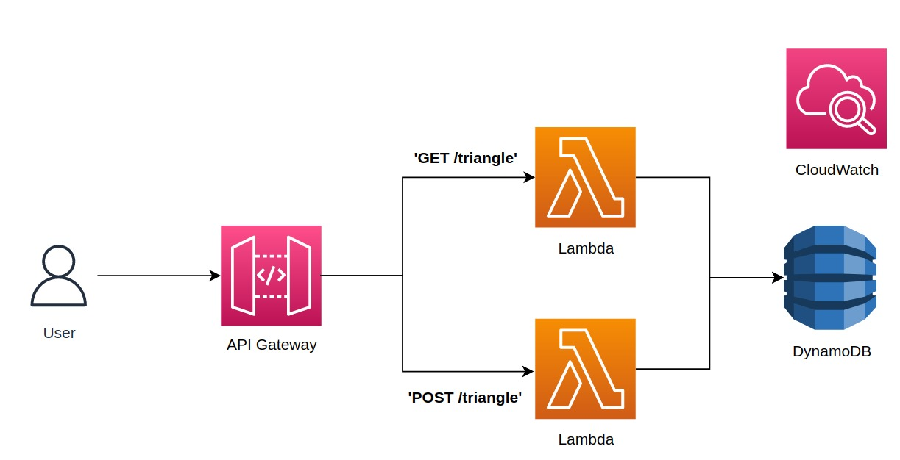

# AWSChalenge

This project consists of a triangle classification API, made of an AWS CDK project. The CDK deploys:
- 1 API Gateway
- 2 NodeJS Lambdas
- 1 DynamoDB Table

The communication between the components occurs as shown below:



# Installation

Fisrt of all, make sure you have [nodeJS](https://nodejs.org/en/download) and [AWS CLI](https://docs.aws.amazon.com/cli/latest/userguide/cli-chap-getting-started.html) properly installed and configured.

Navigate to the root folder of the project and run: 
```bash
npm i
```
This will install all the dependencies for the Typescript CDK to work properly.

Each lambda function to be deployed has its own code and dependencies under the folder *src/lambda/lambda_name*. So, **for each lambda**, navigate to the main folder (e.g. *src/lambda/lambda_name/main*) and execute:

```bash
npm i
```

This will install all the dependencies for the lambda to work properly.

# Deploy

Navigate to the CDK project root folder and run:
```bash
cdk deploy
```

> :warning: **Attention**: You might have problems in this command if your AWS CLI is not properly configured. Make sure you pass a valid user credential with the needed permissions.


# Tests

Likewise, the CDK project and the lambdas have differents tests for each.

The CDK project has integrations tests, to be done after the deploy is complete. Once the deploy is complete, navigate the file *tests/integration/api.spec.ts* and change the endpoint const to:

```javascript
const endpoint = 'YOUR_API_GATEWAY_ENDPOINT'
```

Once this is done, run:
```bash
npm run test
```
For the lambdas, navigate to each of their main folders, and run:
```bash
npm run test
```

# Endpoints

The project has two endpoints, listed below:

- 'POST /triangle'
- 'GET /triangle'

### 'POST /triangle'
This endpoint classifies a triangle and saves it to the database. The possible classifications are *equilateral*, *isosceles*, *scalene*. The endpoint receives a payload, containing three numeric fields called *dimension1*, *dimension2*, *dimension3*. For example:

```json
{
    "dimension1": 3,
    "dimension2": 3,
    "dimension3": 2
}
```

The endpoint returns, once it is able to classify the triangle, an object with is id on the database and the classification. For example:
```json
{
    "uid": "911d7769-d862-4c58-84d6-6f461c3eb735",
    "classification": ["scalene"]
}
```

### 'GET /triangle'
This endpoint receives no parameters and returns a list of the current saved classifications. For exeample:

```json
{
    "id": "911d7769-d862-4c58-84d6-6f461c3eb735",
    "classification": ["scalene"],
    "dimension1": 1,
    "dimension2": 3,
    "dimension3": 2,
    "createdAt": "2022-01-18T13:55:38.973Z"
}
```
